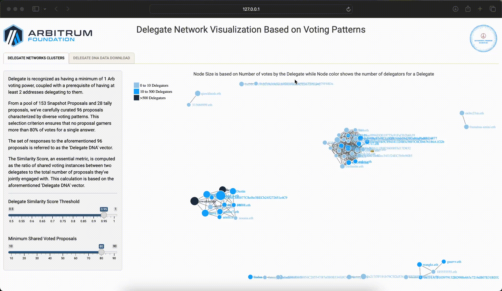
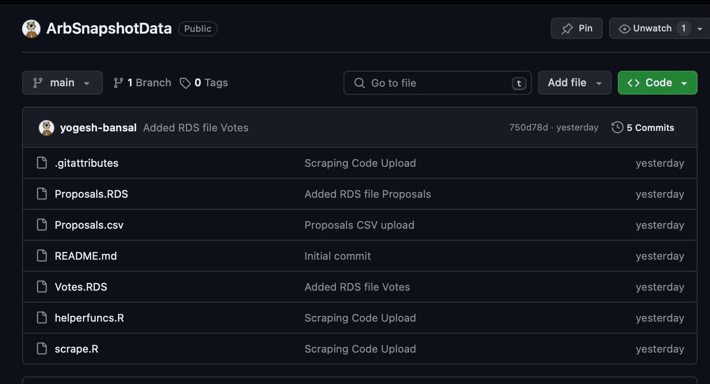
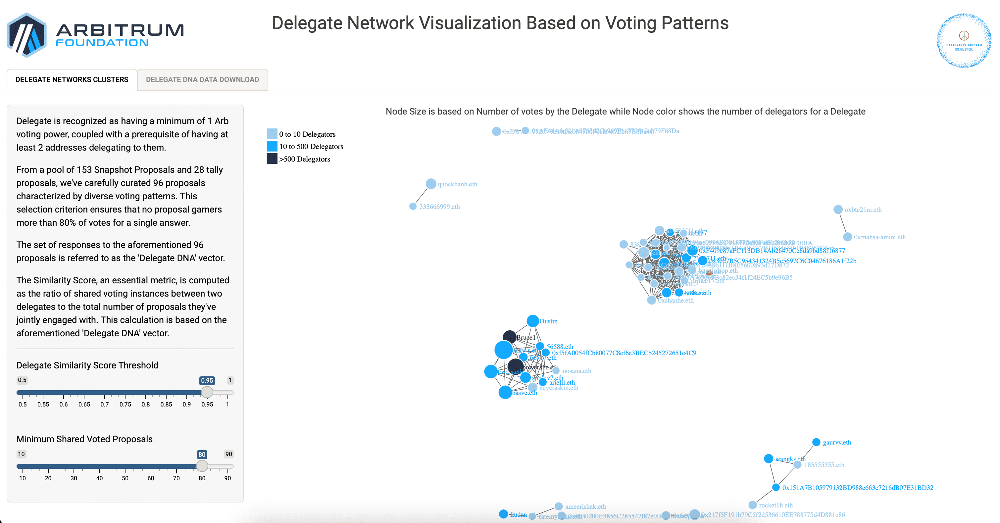
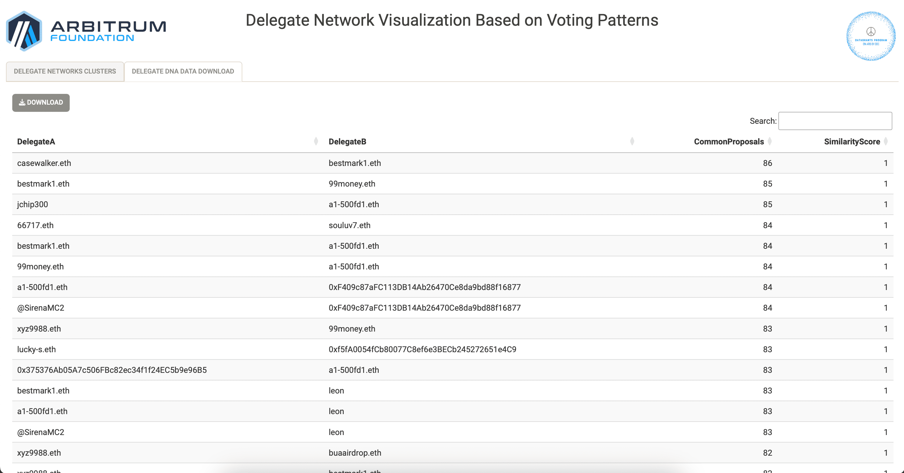

# ArbDelegateDNA
This repository hosts the analysis of potential similar behavior among delegates in the context of governance voting within voting platforms. Leveraging data from 153 Snapshot Proposals and 28 Tally Proposals, we've meticulously selected 96 proposals that exhibit diverse voting patterns, ensuring no proposal received more than 80% of votes for a single answer. This refined dataset allowed us to construct what we refer to as the 'Delegate DNA' vector, a unique identifier of voting behavior patterns for each delegate.

## [App Demo on YouTube](https://www.youtube.com/watch?v=KclTVfbq9NY) <<< Click Here

## [App deployed on a tiny droplet](http://143.198.234.235:4568) <<< Click Here

### Description
To kickstart this bounty, we meticulously gathered data on Arbitrum DAO's governance activities from Snapshot and Tally, channeling these insights into separate repositories. These repositories not only serve as foundational data sources for our current and future bounty submissions but also offer a rich starting point for any subsequent analysis, inviting the community to delve into the nuances of decentralized governance with ease.

## [SnapShot Proposal and Votes Data Scrape Pipeline Repo](https://github.com/yogesh-bansal/ArbSnapshotData)

ArbSnapshotData Repo

&nbsp;
&nbsp;

## [Tally Proposal, Votes and Deelgaets Data Scrape Pipeline Repo](https://github.com/yogesh-bansal/ArbTallyData)

ArbTallyData Repo

&nbsp;
&nbsp;

### Methodology

#### Delegate Requirements
For a delegate to be included in this analysis, they must meet the following criteria:
- Possess a minimum of 1 Arb voting power.
- Be delegated to by at least 2 unique addresses.

#### Delegate DNA Vector
The 'Delegate DNA' vector represents the set of responses to the 96 selected proposals for each delegate, capturing their voting behavior across these proposals.

#### Similarity Score
A key metric in our analysis, the Similarity Score, is calculated as the ratio of shared voting instances between two delegates to the total number of proposals they've jointly participated in. This metric is based on comparisons of 'Delegate DNA' vectors, allowing us to quantify the degree of similarity in voting behavior between any two delegates.

### Walkthrough

Our `ArbDelegateDNA` repo contains a shiny app which analyzes and visualizes data to uncover patterns of support and potential centralization of power within governance voting on Snapshot and Tally.

#### 1. Calculate the Similarity Scores based on DelegateDNA

- `Rscript DNAdataCalcRaw.R`

#### 2. Start the Shiny App

- Open R console and Type `shiny::runApp()`

Network showing users voting in a similar panel based on similarity & Covoted proposals cutoff based on DelegateDNA

&nbsp;
&nbsp;

Raw Data export of all user pairs with their Number of Covoted proposals & Similarity Score based on DelegateDNA

